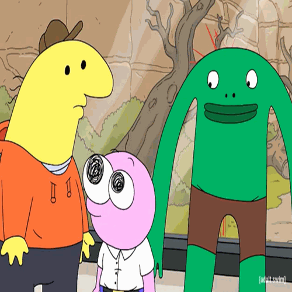

# GIF Creation Project

Create animated GIFs from multiple images with Python using Pillow and imageio.



## Installation

Ensure you have Python and pip installed. Clone the repository and install dependencies.

```bash
git clone https://github.com/haileyrthomas01/creategif.git
cd creategif
pip install -r requirements.txt
